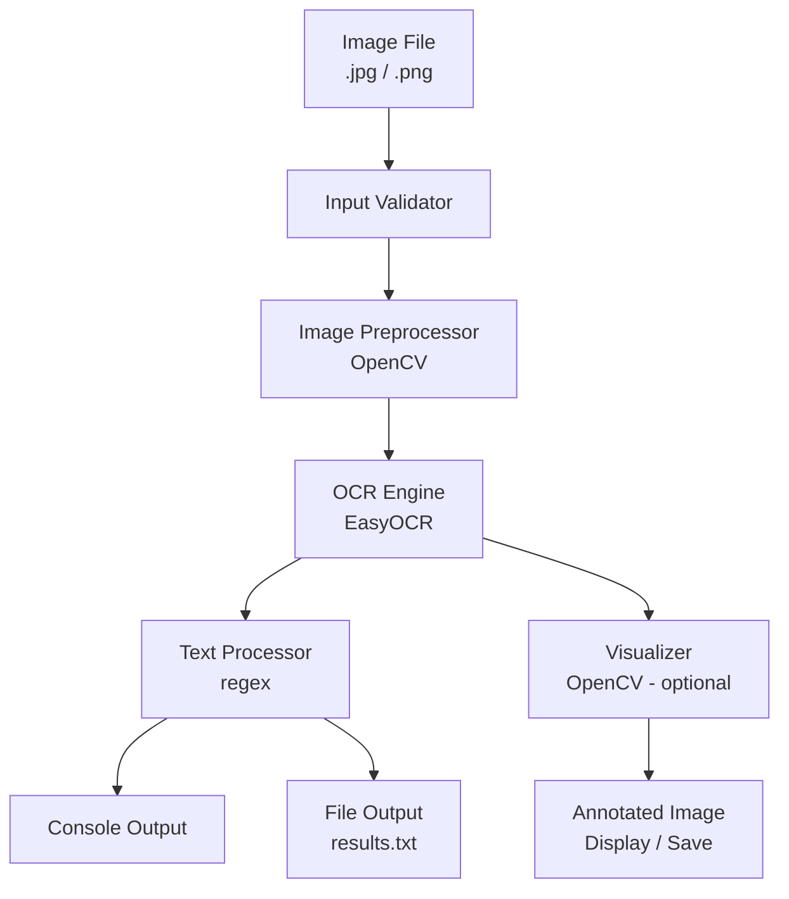
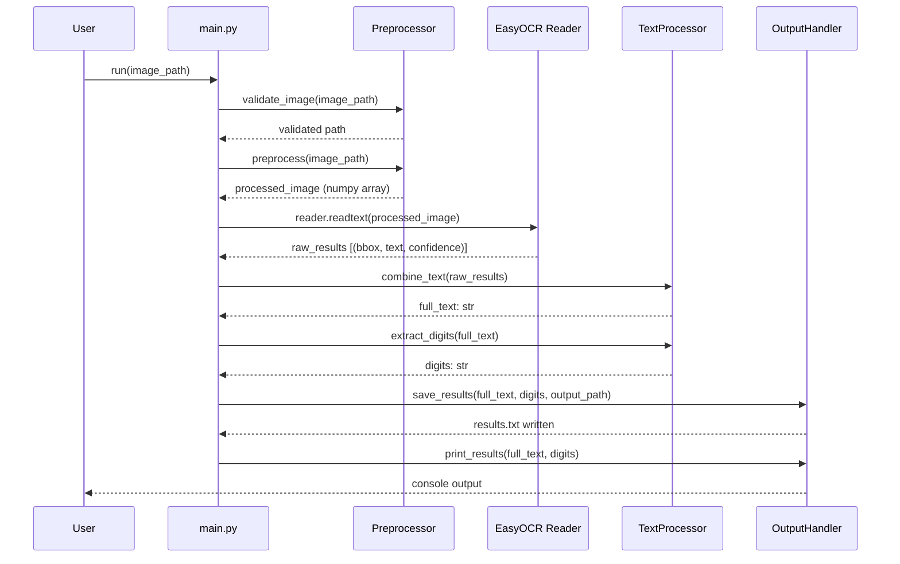
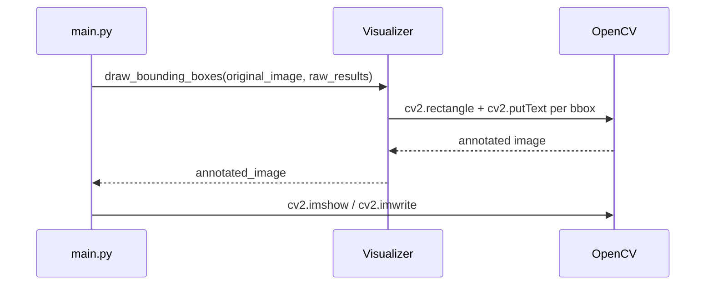

# Design Document: EasyOCR Text Extractor

## Overview

A Python-based OCR pipeline that accepts JPG or PNG images and extracts all detected text as well as numeric digits specifically. The system uses OpenCV for image preprocessing, EasyOCR as the OCR engine, and outputs results both to the console and a `.txt` file, with optional bounding-box visualization.

The design prioritises simplicity and beginner-friendliness: a single well-structured Python script with clear comments, no web frameworks, and full Windows compatibility.

## Architecture



## Sequence Diagrams

### Main Processing Flow



### Optional Visualization Flow



## Components and Interfaces

### Component 1: InputValidator

**Purpose**: Ensures the provided file path points to a readable JPG or PNG image before any processing begins.

**Interface**:
```python
def validate_image(image_path: str) -> str:
    """
    Validates that image_path exists and has a supported extension.
    Returns the resolved absolute path.
    Raises FileNotFoundError or ValueError on failure.
    """
```

**Responsibilities**:
- Check file existence on disk
- Enforce `.jpg`, `.jpeg`, `.png` extensions
- Return the resolved path for downstream use

---

### Component 2: Preprocessor

**Purpose**: Applies a sequence of OpenCV transformations to improve OCR accuracy.

**Interface**:
```python
def preprocess(image_path: str, resize_factor: float = 1.0) -> np.ndarray:
    """
    Loads image, converts to grayscale, applies Gaussian blur,
    then adaptive thresholding. Optionally resizes.
    Returns processed image as a NumPy array.
    """
```

**Responsibilities**:
- Load image with `cv2.imread`
- Convert BGR → Grayscale (`cv2.cvtColor`)
- Apply Gaussian blur for noise reduction (`cv2.GaussianBlur`)
- Apply adaptive thresholding (`cv2.adaptiveThreshold`)
- Optionally resize (`cv2.resize`) when `resize_factor != 1.0`

---

### Component 3: OCREngine (wrapper around EasyOCR)

**Purpose**: Initialises the EasyOCR reader once and exposes a clean `extract` method.

**Interface**:
```python
class OCREngine:
    def __init__(self, languages: list[str] = ["en"]) -> None: ...

    def extract(self, image: np.ndarray) -> list[tuple]:
        """
        Runs EasyOCR on the preprocessed image.
        Returns list of (bbox, text, confidence) tuples.
        """
```

**Responsibilities**:
- Initialise `easyocr.Reader` once (expensive operation)
- Call `reader.readtext(image)` and return raw results
- Expose language configuration

---

### Component 4: TextProcessor

**Purpose**: Transforms raw OCR results into usable text and digit strings.

**Interface**:
```python
def combine_text(ocr_results: list[tuple]) -> str:
    """Joins all detected text fragments into a single string."""

def extract_digits(text: str) -> str:
    """Returns only the digit characters found in text using regex."""
```

**Responsibilities**:
- Join text fragments with a space separator
- Use `re.findall(r'\d+', text)` to isolate numeric sequences
- Return digits as a joined string (e.g. `"42 100 7"`)

---

### Component 5: OutputHandler

**Purpose**: Writes results to console and to a `.txt` file.

**Interface**:
```python
def print_results(full_text: str, digits: str) -> None:
    """Prints extracted text and digits to stdout."""

def save_results(full_text: str, digits: str, output_path: str) -> None:
    """Writes full_text and digits to a plain-text file."""
```

**Responsibilities**:
- Format and print results clearly
- Write UTF-8 encoded output file

---

### Component 6: Visualizer (optional)

**Purpose**: Annotates the original image with bounding boxes and text labels.

**Interface**:
```python
def draw_bounding_boxes(image: np.ndarray, ocr_results: list[tuple]) -> np.ndarray:
    """
    Draws rectangles and text labels on a copy of the image.
    Returns the annotated image.
    """

def show_image(image: np.ndarray, window_title: str = "OCR Result") -> None:
    """Displays the annotated image using cv2.imshow."""

def save_image(image: np.ndarray, output_path: str) -> None:
    """Saves the annotated image to disk."""
```

---

## Data Models

### OCRResult (internal tuple structure)

```python
# EasyOCR returns a list of these tuples:
# (bbox, text, confidence)
# bbox: list of 4 [x, y] corner points  →  [[x1,y1],[x2,y1],[x2,y2],[x1,y2]]
# text: str  →  detected text fragment
# confidence: float  →  0.0 – 1.0

OCRResult = tuple[list[list[int]], str, float]
```

### ProcessingConfig

```python
from dataclasses import dataclass

@dataclass
class ProcessingConfig:
    image_path: str          # absolute path to input image
    languages: list[str]     # EasyOCR language codes, default ["en"]
    resize_factor: float     # 1.0 = no resize; >1.0 = upscale
    output_path: str         # path for results .txt file
    visualize: bool          # whether to draw bounding boxes
    save_annotated: bool     # whether to save annotated image
```

**Validation Rules**:
- `image_path` must exist and end with `.jpg`, `.jpeg`, or `.png`
- `resize_factor` must be in range `(0.0, 5.0]`
- `output_path` must end with `.txt`
- `languages` must be a non-empty list

---

## Algorithmic Pseudocode

### Main Pipeline Algorithm

```pascal
ALGORITHM run_ocr_pipeline(config: ProcessingConfig)
INPUT: config of type ProcessingConfig
OUTPUT: (full_text: str, digits: str)

BEGIN
  ASSERT file_exists(config.image_path)
  ASSERT extension_supported(config.image_path)

  // Phase 1: Preprocessing
  image ← cv2.imread(config.image_path)
  gray  ← cv2.cvtColor(image, GRAYSCALE)
  
  IF config.resize_factor ≠ 1.0 THEN
    gray ← cv2.resize(gray, scale=config.resize_factor)
  END IF
  
  blurred   ← cv2.GaussianBlur(gray, kernel=(5,5), sigma=0)
  processed ← cv2.adaptiveThreshold(blurred, ADAPTIVE_GAUSSIAN)

  ASSERT processed IS valid numpy array

  // Phase 2: OCR
  reader      ← easyocr.Reader(config.languages)
  ocr_results ← reader.readtext(processed)

  ASSERT ocr_results IS list

  // Phase 3: Text Processing
  full_text ← JOIN([text FOR (bbox, text, conf) IN ocr_results], separator=" ")
  digits    ← JOIN(re.findall('\d+', full_text), separator=" ")

  // Phase 4: Output
  PRINT full_text
  PRINT digits
  WRITE full_text AND digits TO config.output_path

  // Phase 5: Visualization (optional)
  IF config.visualize THEN
    annotated ← draw_bounding_boxes(image, ocr_results)
    DISPLAY annotated
    IF config.save_annotated THEN
      SAVE annotated TO disk
    END IF
  END IF

  ASSERT file_exists(config.output_path)

  RETURN (full_text, digits)
END
```

**Preconditions**:
- `config.image_path` points to a readable JPG or PNG file
- EasyOCR and OpenCV are installed in the Python environment
- Write permission exists for `config.output_path`

**Postconditions**:
- `full_text` contains all OCR-detected text joined by spaces
- `digits` contains only numeric sequences from `full_text`
- A `.txt` file exists at `config.output_path`

---

### Preprocessing Algorithm

```pascal
ALGORITHM preprocess(image_path, resize_factor)
INPUT: image_path: str, resize_factor: float
OUTPUT: processed: np.ndarray

BEGIN
  image ← cv2.imread(image_path)
  
  IF image IS NULL THEN
    RAISE ValueError("Cannot read image at path")
  END IF

  gray ← cv2.cvtColor(image, cv2.COLOR_BGR2GRAY)

  IF resize_factor ≠ 1.0 THEN
    h, w ← gray.shape
    new_w ← int(w * resize_factor)
    new_h ← int(h * resize_factor)
    gray ← cv2.resize(gray, (new_w, new_h), interpolation=cv2.INTER_LINEAR)
  END IF

  blurred ← cv2.GaussianBlur(gray, (5, 5), 0)

  processed ← cv2.adaptiveThreshold(
    blurred,
    maxValue=255,
    adaptiveMethod=cv2.ADAPTIVE_THRESH_GAUSSIAN_C,
    thresholdType=cv2.THRESH_BINARY,
    blockSize=11,
    C=2
  )

  RETURN processed
END
```

**Preconditions**:
- `image_path` is a valid, readable image file
- `resize_factor` is in `(0.0, 5.0]`

**Postconditions**:
- Returns a 2D uint8 NumPy array (grayscale, thresholded)
- Pixel values are either 0 or 255

**Loop Invariants**: N/A (no loops)

---

### Digit Extraction Algorithm

```pascal
ALGORITHM extract_digits(text)
INPUT: text: str
OUTPUT: digits: str

BEGIN
  IF text IS empty THEN
    RETURN ""
  END IF

  matches ← re.findall('\d+', text)
  // matches is a list of digit-only substrings, e.g. ["42", "100"]

  digits ← JOIN(matches, separator=" ")

  RETURN digits
END
```

**Preconditions**:
- `text` is a string (may be empty)

**Postconditions**:
- Returns a string containing only digit sequences separated by spaces
- Returns empty string if no digits found

---

## Key Functions with Formal Specifications

### `validate_image(image_path)`

```python
def validate_image(image_path: str) -> str
```

**Preconditions**:
- `image_path` is a non-empty string

**Postconditions**:
- Returns resolved absolute path if file exists and extension is valid
- Raises `FileNotFoundError` if file does not exist
- Raises `ValueError` if extension is not `.jpg`, `.jpeg`, or `.png`

---

### `preprocess(image_path, resize_factor)`

```python
def preprocess(image_path: str, resize_factor: float = 1.0) -> np.ndarray
```

**Preconditions**:
- `image_path` is a valid, readable image file path
- `0.0 < resize_factor <= 5.0`

**Postconditions**:
- Returns 2D NumPy array with dtype `uint8`
- All pixel values are 0 or 255 (binary thresholded)
- Shape is `(h * resize_factor, w * resize_factor)` when resized

---

### `OCREngine.extract(image)`

```python
def extract(self, image: np.ndarray) -> list[tuple]
```

**Preconditions**:
- `image` is a valid NumPy array (2D grayscale or 3D BGR)
- `self` has been initialised with a valid language list

**Postconditions**:
- Returns a list (possibly empty) of `(bbox, text, confidence)` tuples
- Each `text` is a non-empty string
- Each `confidence` is in `[0.0, 1.0]`

---

### `combine_text(ocr_results)`

```python
def combine_text(ocr_results: list[tuple]) -> str
```

**Preconditions**:
- `ocr_results` is a list of EasyOCR result tuples

**Postconditions**:
- Returns a single string with all text fragments joined by spaces
- Returns empty string if `ocr_results` is empty

---

### `extract_digits(text)`

```python
def extract_digits(text: str) -> str
```

**Preconditions**:
- `text` is a string

**Postconditions**:
- Returns string of digit sequences separated by spaces
- Returns `""` if no digits present

---

## Example Usage

```python
from ocr_extractor import run_ocr_pipeline, ProcessingConfig

# Basic usage
config = ProcessingConfig(
    image_path="sample.jpg",
    languages=["en"],
    resize_factor=1.5,       # upscale for better accuracy
    output_path="results.txt",
    visualize=True,
    save_annotated=False
)

full_text, digits = run_ocr_pipeline(config)

print(f"Extracted text : {full_text}")
print(f"Digits only    : {digits}")
# Output:
# Extracted text : Invoice 1042 Total 99.50 USD
# Digits only    : 1042 99 50
```

```python
# Command-line usage (via __main__ block)
# python ocr_extractor.py --image sample.png --resize 1.5 --visualize
```

---

## Correctness Properties

- For any valid image, `full_text` contains only characters present in the OCR output
- `digits` is always a subset of characters in `full_text`
- If `full_text` contains no digit characters, `digits` is an empty string
- The output `.txt` file always contains both `full_text` and `digits` sections
- Preprocessing never changes image dimensions unless `resize_factor != 1.0`
- `OCREngine` initialises the EasyOCR reader exactly once per instance

---

## Error Handling

### Error Scenario 1: File Not Found

**Condition**: `image_path` does not exist on disk
**Response**: Raise `FileNotFoundError` with a descriptive message
**Recovery**: User corrects the path and re-runs

### Error Scenario 2: Unsupported File Format

**Condition**: File extension is not `.jpg`, `.jpeg`, or `.png`
**Response**: Raise `ValueError("Unsupported format. Use JPG or PNG.")`
**Recovery**: User converts image and re-runs

### Error Scenario 3: Unreadable Image

**Condition**: `cv2.imread` returns `None` (corrupt file or permission issue)
**Response**: Raise `ValueError("Cannot read image. File may be corrupt.")`
**Recovery**: User verifies file integrity

### Error Scenario 4: No Text Detected

**Condition**: EasyOCR returns an empty list
**Response**: Return empty strings for both `full_text` and `digits`; print a warning
**Recovery**: User tries with a higher `resize_factor` or better-quality image

### Error Scenario 5: Write Permission Denied

**Condition**: Cannot write to `output_path`
**Response**: Catch `PermissionError`, print warning, skip file save
**Recovery**: User changes `output_path` to a writable location

---

## Testing Strategy

### Unit Testing Approach

Test each component in isolation using `pytest`:
- `test_validate_image`: valid path, missing file, wrong extension
- `test_preprocess`: output shape, dtype, pixel value range
- `test_combine_text`: empty list, single item, multiple items
- `test_extract_digits`: no digits, only digits, mixed text, decimal numbers

### Property-Based Testing Approach

**Property Test Library**: `hypothesis`

- For any string `s`, `extract_digits(s)` contains only digit characters and spaces
- For any string `s`, every digit sequence in `extract_digits(s)` appears in `s`
- For any list of OCR tuples, `combine_text(results)` length >= number of non-empty text fragments

### Integration Testing Approach

- End-to-end test with a known sample image (e.g. a PNG with text "Hello 42")
- Assert `full_text` contains `"Hello"` and `"42"`
- Assert `digits` contains `"42"`
- Assert `results.txt` is created and contains expected content

---

## Performance Considerations

- EasyOCR reader initialisation is slow (~2–5 s); initialise once and reuse for batch processing
- Upscaling large images (`resize_factor > 2.0`) increases memory usage significantly
- Gaussian blur kernel size `(5, 5)` is a good default; larger kernels slow preprocessing
- For batch use, consider caching the `OCREngine` instance across calls

---

## Security Considerations

- Validate file paths to prevent directory traversal (use `os.path.abspath` + existence check)
- Do not execute any content extracted from images as code
- Limit `resize_factor` to a safe upper bound (e.g. `5.0`) to prevent memory exhaustion

---

## Dependencies

| Package    | Version (min) | Purpose                        |
|------------|---------------|--------------------------------|
| easyocr    | 1.7.0         | OCR engine                     |
| opencv-python | 4.8.0      | Image loading & preprocessing  |
| numpy      | 1.24.0        | Array operations               |
| torch      | 2.0.0         | EasyOCR backend (auto-installed)|
