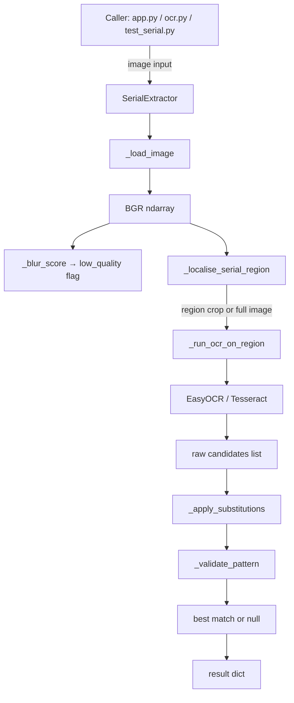

# Design Document: Serial Number Extraction

## Overview

This feature adds a dedicated serial number extractor to the existing meter OCR project. Utility meters display a serial number (e.g. `I20BA008111`) as large alphanumeric text on the meter body, physically separate from the digit-drum display. The extractor must operate independently of `OCRExtractor` and must not modify any existing files except `app.py` and `ocr.py`.

The serial number pattern is: `[A-Z][0-9]{2}[A-Z]{2}[0-9]{6}` — 11 characters total (e.g. `I20BA008111`, `I22BA271986`).

### Key Design Decisions

- **New file only**: `serial_extractor.py` contains the `SerialExtractor` class. `ocr_extractor.py` is untouched.
- **Reuse helpers via import**: `_load_image`, `_blur_score`, and `_get_easy_reader` from `ocr_extractor.py` are imported directly — no duplication.
- **EasyOCR as primary engine**: The existing project already uses EasyOCR for meter reading; serial numbers are alphanumeric so EasyOCR with an alphanumeric allowlist is the natural choice.
- **Tesseract as fallback**: If EasyOCR is unavailable, fall back to Tesseract with `--psm 11` (sparse text) and an alphanumeric whitelist.
- **Region localisation via bounding-box height heuristic**: Large-text detections outside the digit-drum area (identified by aspect ratio and vertical position) are used to narrow the search region before full-image fallback.

---

## Architecture



The `SerialExtractor` class is self-contained. It imports only from the standard library, `cv2`, `numpy`, and the helpers already present in `ocr_extractor.py`.

---

## Components and Interfaces

### `SerialExtractor` (serial_extractor.py)

```python
class SerialExtractor:
    def __init__(self, blur_threshold: float = 40.0) -> None: ...

    def extract_serial_number(
        self,
        image: str | Path | np.ndarray,
        region_hint: dict | None = None,
    ) -> dict: ...
```

**Constructor parameter**
- `blur_threshold` — Laplacian-variance cutoff. `0` disables blur detection.

**`extract_serial_number` return dict**

| Key | Type | Description |
|---|---|---|
| `serial_number` | `str \| None` | Validated serial or `null` |
| `confidence` | `float` | OCR confidence in `[0.0, 1.0]` (or `0.0` when null) |
| `low_quality` | `bool` | `true` when Laplacian variance < `blur_threshold` |
| `bounding_box` | `dict \| None` | `{x, y, width, height}` in original image coords, or `null` |

**`region_hint` dict** (optional)

```json
{"x": 0, "y": 0, "width": 200, "height": 80}
```

### Private helpers (module-level in serial_extractor.py)

| Function | Purpose |
|---|---|
| `_apply_substitutions(text)` | Replace `0→O`, `1→I` where needed for pattern match |
| `_validate_pattern(text)` | Return `True` if text matches `[A-Z][0-9]{2}[A-Z]{2}[0-9]{6}` |
| `_localise_serial_region(bgr)` | Return crop coordinates `(x1, y1, x2, y2)` or `None` |
| `_run_ocr_candidates(bgr_crop)` | Return list of `(text, confidence, bbox)` tuples |

### Changes to existing files

**`ocr.py`** — add `--serial` flag; when present call `SerialExtractor.extract_serial_number()`; combine with `--meter` result if both flags given; exit code 3 when `serial_number` is null.

**`app.py`** — add `serial_output` Textbox to the UI; call `SerialExtractor.extract_serial_number()` inside `run_ocr()` when `meter_mode` is enabled; display "Not detected" when result is null.

---

## Data Models

### Result dict (JSON-serialisable)

```json
{
  "serial_number": "I20BA008111",
  "confidence": 0.92,
  "low_quality": false,
  "bounding_box": {
    "x": 45,
    "y": 12,
    "width": 180,
    "height": 32
  }
}
```

Null result:

```json
{
  "serial_number": null,
  "confidence": 0.0,
  "low_quality": false,
  "bounding_box": null
}
```

### Combined CLI result (--meter --serial)

```json
{
  "meter_reading": {
    "integer_part": "01001",
    "fraction_part": "397",
    "reading": "01001.397",
    "raw_text": "01001397",
    "confidence": 0.85,
    "low_quality": false,
    "bounding_boxes": []
  },
  "serial_number": {
    "serial_number": "I20BA008111",
    "confidence": 0.92,
    "low_quality": false,
    "bounding_box": {"x": 45, "y": 12, "width": 180, "height": 32}
  }
}
```

### OCR substitution table

| Raw char | Position in pattern | Substituted to |
|---|---|---|
| `0` | position 0 (must be letter) | `O` |
| `1` | position 0 (must be letter) | `I` |
| `0` | positions 3–4 (must be letters) | `O` |
| `1` | positions 3–4 (must be letters) | `I` |

Substitution is applied only when the original string does not match and the substituted string does.

### Region localisation heuristic

1. Run EasyOCR on the full image with no allowlist to get all bounding boxes.
2. Filter detections where `height > image_height * 0.05` (large text) and `len(text) >= 6`.
3. Exclude detections whose horizontal centre falls within the digit-drum zone (central 60% of image width, lower 50% of image height — where the meter reading lives).
4. If any qualifying detections remain, crop a horizontal band spanning their y-range ± 20 px.
5. If no qualifying detections, return `None` → caller uses full image.


---

## Correctness Properties

*A property is a characteristic or behavior that should hold true across all valid executions of a system — essentially, a formal statement about what the system should do. Properties serve as the bridge between human-readable specifications and machine-verifiable correctness guarantees.*

### Property 1: Result schema invariant

*For any* valid image input (file path, base64 string, or numpy BGR array), calling `extract_serial_number` must return a dict containing exactly the keys `serial_number`, `confidence`, `low_quality`, and `bounding_box`, with types `str|None`, `float`, `bool`, and `dict|None` respectively.

**Validates: Requirements 1.1, 1.2, 8.1**

### Property 2: Pattern acceptance

*For any* string that matches `[A-Z][0-9]{2}[A-Z]{2}[0-9]{6}`, when it is the only OCR candidate returned for an image, `extract_serial_number` must return that string as `serial_number` with `confidence > 0.0`.

**Validates: Requirements 2.1**

### Property 3: Pattern rejection

*For any* string that does not match `[A-Z][0-9]{2}[A-Z]{2}[0-9]{6}` and cannot be made to match via the defined substitutions, when it is the only OCR candidate, `extract_serial_number` must return `serial_number` as `null` and `confidence` as `0.0`.

**Validates: Requirements 2.2, 8.2**

### Property 4: Highest-confidence candidate wins

*For any* set of two or more OCR candidates that all match the serial number pattern, `extract_serial_number` must return the candidate with the highest confidence score.

**Validates: Requirements 2.3**

### Property 5: Substitution enables match

*For any* string that does not match the pattern in its raw form but does match after applying the substitutions `0→O` and `1→I` at letter positions, `extract_serial_number` must return the substituted (corrected) string as `serial_number`.

**Validates: Requirements 2.4**

### Property 6: Blur detection threshold

*For any* image whose Laplacian variance is below the configured `blur_threshold` (when `blur_threshold > 0`), `extract_serial_number` must set `low_quality` to `true` in the result.

**Validates: Requirements 4.1, 8.3**

### Property 7: Disabled blur detection

*For any* image (including synthetically blurred ones) when `SerialExtractor` is constructed with `blur_threshold=0`, `extract_serial_number` must always set `low_quality` to `false`.

**Validates: Requirements 4.2**

### Property 8: Region hint constrains OCR

*For any* image containing a valid serial number, when a `region_hint` is provided that does not contain the serial number text, `extract_serial_number` must return `serial_number` as `null`.

**Validates: Requirements 3.3**

### Property 9: JSON round-trip

*For any* result dict produced by `extract_serial_number`, serialising to JSON with `json.dumps` and deserialising with `json.loads` must produce a dict equal to the original.

**Validates: Requirements 7.1, 7.2**

---

## Error Handling

| Scenario | Behaviour |
|---|---|
| File path does not exist | Re-raise `FileNotFoundError` from `_load_image` |
| Unsupported image format | Re-raise `ValueError` from `_load_image` |
| EasyOCR unavailable | Fall back to Tesseract; log a warning |
| Tesseract unavailable | Raise `EnvironmentError` with install instructions |
| No OCR candidates found | Return null result (`serial_number=null`, `confidence=0.0`) |
| `region_hint` out of image bounds | Clamp to image dimensions; log a warning |
| Image is all-black / degenerate | `_blur_score` returns 0.0 → `low_quality=true`; OCR returns no candidates → null result |

All errors that prevent returning a result dict are propagated to the caller. Errors that only affect quality (e.g. EasyOCR fallback) are logged and handled gracefully.

---

## Testing Strategy

### Dual testing approach

Both unit tests and property-based tests are required. They are complementary:

- **Unit tests** cover specific examples, integration points, and error conditions.
- **Property tests** verify universal correctness across randomly generated inputs.

### Unit tests (test_serial.py)

- Schema test: call `extract_serial_number` on a synthetic image and assert all four keys are present with correct types.
- Blur detection test: create a synthetically blurred image, assert `low_quality=true`.
- Pattern rejection test: mock OCR to return a non-matching string, assert `serial_number=null`.
- CLI `--serial` flag: call `main()` with `--serial` and a test image, assert JSON output contains `serial_number` key.
- CLI `--meter --serial` combined: assert combined JSON has both `meter_reading` and `serial_number` keys.
- CLI exit code 3: assert `SystemExit(3)` when `serial_number` is null.
- `blur_threshold=0` disables blur: blurry image with threshold 0 returns `low_quality=false`.
- Default `blur_threshold`: instantiate `SerialExtractor()` and assert `blur_threshold == 40.0`.

### Property-based tests (test_serial.py, using `hypothesis`)

Property-based testing library: **Hypothesis** (Python). Each test runs a minimum of 100 examples.

Tag format: `# Feature: serial-number-extraction, Property N: <property_text>`

**PBT 1 — Result schema invariant**
```
# Feature: serial-number-extraction, Property 1: result schema invariant
@given(st.binary().map(make_bgr_from_bytes))
def test_schema_property(image): ...
```
Generate random BGR arrays; assert result always has the four required keys with correct types.

**PBT 2 — Pattern acceptance**
```
# Feature: serial-number-extraction, Property 2: pattern acceptance
@given(valid_serial_strategy())
def test_pattern_acceptance(serial_str): ...
```
Generate strings matching `[A-Z][0-9]{2}[A-Z]{2}[0-9]{6}`; render onto a synthetic image; assert `serial_number == serial_str`.

**PBT 3 — Pattern rejection**
```
# Feature: serial-number-extraction, Property 3: pattern rejection
@given(invalid_serial_strategy())
def test_pattern_rejection(bad_str): ...
```
Generate strings that do not match the pattern and cannot be fixed by substitution; mock OCR to return them; assert `serial_number is None` and `confidence == 0.0`.

**PBT 4 — Highest-confidence candidate wins**
```
# Feature: serial-number-extraction, Property 4: highest-confidence candidate wins
@given(st.lists(valid_serial_with_confidence_strategy(), min_size=2))
def test_highest_confidence_wins(candidates): ...
```
Generate multiple valid candidates with distinct confidence scores; mock OCR; assert returned serial matches the highest-confidence candidate.

**PBT 5 — Substitution enables match**
```
# Feature: serial-number-extraction, Property 5: substitution enables match
@given(substitution_required_serial_strategy())
def test_substitution_match(raw_str, expected_str): ...
```
Generate strings that only match after `0→O`/`1→I` substitution; mock OCR; assert `serial_number == expected_str`.

**PBT 6 — Blur detection threshold**
```
# Feature: serial-number-extraction, Property 6: blur detection threshold
@given(st.floats(min_value=41.0, max_value=500.0))
def test_blur_threshold(threshold): ...
```
Create a blurry image with Laplacian variance < threshold; assert `low_quality=true`.

**PBT 7 — Disabled blur detection**
```
# Feature: serial-number-extraction, Property 7: disabled blur detection
@given(st.binary().map(make_bgr_from_bytes))
def test_blur_disabled(image): ...
```
With `blur_threshold=0`, assert `low_quality=false` for any image.

**PBT 8 — Region hint constrains OCR**
```
# Feature: serial-number-extraction, Property 8: region hint constrains OCR
@given(valid_serial_image_strategy(), empty_region_hint_strategy())
def test_region_hint_excludes_serial(image, hint): ...
```
Provide a region hint that does not overlap the serial number; assert `serial_number is None`.

**PBT 9 — JSON round-trip**
```
# Feature: serial-number-extraction, Property 9: JSON round-trip
@given(result_dict_strategy())
def test_json_roundtrip(result): ...
```
Generate valid result dicts; assert `json.loads(json.dumps(result)) == result`.
